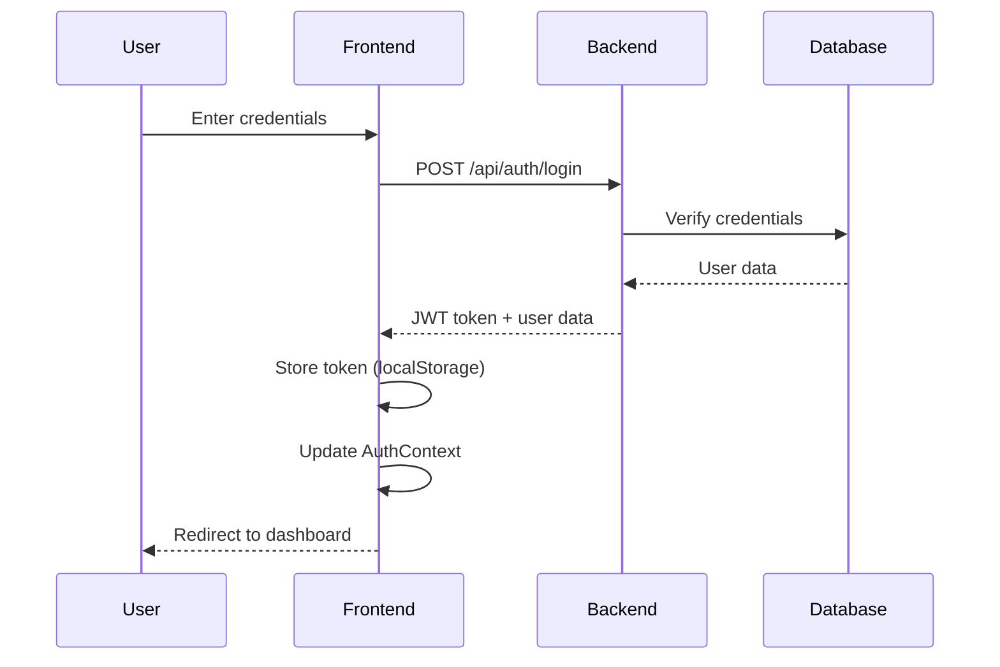

# Gaming Platform Architecture - Brutalist Arcade Style

## 🎮 Project Overview

A React-based gaming platform inspired by brutus.finance's dark, brutalist aesthetic, featuring modular HTML5 game integration with user profiles, leaderboards, and cross-game progression.

## 📋 Technology Stack

### Frontend
- **Framework**: React 18+ with TypeScript
- **Build Tool**: Vite
- **Routing**: React Router v6
- **State Management**: React Context API
- **Styling**: CSS Modules + CSS Variables
- **HTTP Client**: Axios
- **Game Communication**: postMessage API

### Backend
- **Runtime**: Node.js 18+
- **Framework**: Express.js
- **Database**: MongoDB with Mongoose
- **Authentication**: JWT (JSON Web Tokens)
- **Real-time**: Socket.io (for leaderboards)
- **Validation**: Joi
- **Security**: Helmet, CORS, bcrypt

## 🏗️ Architecture Diagram

```
┌─────────────────────────────────────────────────────────────┐
│                     FRONTEND (React)                         │
├─────────────────────────────────────────────────────────────┤
│  ┌──────────────┐  ┌──────────────┐  ┌──────────────┐      │
│  │   Landing    │  │    Games     │  │   Profile    │      │
│  │     Page     │  │     Grid     │  │     Page     │      │
│  └──────────────┘  └──────────────┘  └──────────────┘      │
│                                                               │
│  ┌──────────────────────────────────────────────────────┐   │
│  │           Game Player (iframe + postMessage)         │   │
│  └──────────────────────────────────────────────────────┘   │
│                                                               │
│  ┌──────────────────────────────────────────────────────┐   │
│  │              Context API State Layer                  │   │
│  │  • AuthContext  • GameContext  • LeaderboardContext  │   │
│  └──────────────────────────────────────────────────────┘   │
└─────────────────────────────────────────────────────────────┘
                            ↕ HTTP/WebSocket
┌─────────────────────────────────────────────────────────────┐
│                     BACKEND (Node.js)                        │
├─────────────────────────────────────────────────────────────┤
│  ┌──────────────┐  ┌──────────────┐  ┌──────────────┐      │
│  │     Auth     │  │    Games     │  │  Leaderboard │      │
│  │   Service    │  │   Service    │  │   Service    │      │
│  └──────────────┘  └──────────────┘  └──────────────┘      │
│                                                               │
│  ┌──────────────────────────────────────────────────────┐   │
│  │                  MongoDB Database                     │   │
│  │  • Users  • GameScores  • Achievements  • Sessions   │   │
│  └──────────────────────────────────────────────────────┘   │
└─────────────────────────────────────────────────────────────┘
```

## 📁 Project Structure

```
gaming-platform/
├── client/                          # React frontend
│   ├── public/
│   │   └── games/                   # HTML5 game files
│   │       ├── flapcat/
│   │       ├── space-shoot/
│   │       └── t-rex/
│   ├── src/
│   │   ├── assets/                  # Images, fonts, icons
│   │   │   ├── fonts/
│   │   │   ├── images/
│   │   │   └── icons/
│   │   ├── components/              # Reusable components
│   │   │   ├── common/
│   │   │   │   ├── Button/
│   │   │   │   ├── Card/
│   │   │   │   ├── GlitchText/
│   │   │   │   ├── Navbar/
│   │   │   │   └── ScanlineEffect/
│   │   │   ├── game/
│   │   │   │   ├── GameCard/
│   │   │   │   ├── GameGrid/
│   │   │   │   ├── GamePlayer/
│   │   │   │   ├── GameWrapper/
│   │   │   │   └── ScoreTracker/
│   │   │   ├── leaderboard/
│   │   │   │   ├── LeaderboardTable/
│   │   │   │   └── LeaderboardEntry/
│   │   │   └── profile/
│   │   │       ├── ProfileCard/
│   │   │       ├── StatsDisplay/
│   │   │       └── AchievementBadge/
│   │   ├── contexts/                # React Context providers
│   │   │   ├── AuthContext.tsx
│   │   │   ├── GameContext.tsx
│   │   │   ├── LeaderboardContext.tsx
│   │   │   └── ThemeContext.tsx
│   │   ├── hooks/                   # Custom React hooks
│   │   │   ├── useAuth.ts
│   │   │   ├── useGame.ts
│   │   │   ├── useLeaderboard.ts
│   │   │   ├── useLocalStorage.ts
│   │   │   └── usePostMessage.ts
│   │   ├── pages/                   # Page components
│   │   │   ├── Landing/
│   │   │   │   ├── Landing.tsx
│   │   │   │   ├── HeroSection.tsx
│   │   │   │   └── Landing.module.css
│   │   │   ├── Games/
│   │   │   │   ├── GamesPage.tsx
│   │   │   │   └── GamesPage.module.css
│   │   │   ├── GamePlay/
│   │   │   │   ├── GamePlayPage.tsx
│   │   │   │   └── GamePlayPage.module.css
│   │   │   ├── Profile/
│   │   │   │   ├── ProfilePage.tsx
│   │   │   │   └── ProfilePage.module.css
│   │   │   ├── Leaderboard/
│   │   │   │   ├── LeaderboardPage.tsx
│   │   │   │   └── LeaderboardPage.module.css
│   │   │   └── Auth/
│   │   │       ├── Login.tsx
│   │   │       └── Register.tsx
│   │   ├── services/                # API services
│   │   │   ├── api.ts
│   │   │   ├── authService.ts
│   │   │   ├── gameService.ts
│   │   │   └── leaderboardService.ts
│   │   ├── types/                   # TypeScript types
│   │   │   ├── game.types.ts
│   │   │   ├── user.types.ts
│   │   │   └── leaderboard.types.ts
│   │   ├── utils/                   # Utility functions
│   │   │   ├── gameMessaging.ts
│   │   │   ├── storage.ts
│   │   │   └── validators.ts
│   │   ├── config/                  # Configuration
│   │   │   ├── games.config.ts
│   │   │   └── constants.ts
│   │   ├── styles/                  # Global styles
│   │   │   ├── variables.css
│   │   │   ├── brutalist.css
│   │   │   ├── animations.css
│   │   │   └── global.css
│   │   ├── App.tsx
│   │   ├── main.tsx
│   │   └── vite-env.d.ts
│   ├── index.html
│   ├── package.json
│   ├── tsconfig.json
│   └── vite.config.ts
│
├── server/                          # Node.js backend
│   ├── src/
│   │   ├── config/
│   │   │   ├── database.ts
│   │   │   ├── jwt.ts
│   │   │   └── constants.ts
│   │   ├── controllers/
│   │   │   ├── authController.ts
│   │   │   ├── gameController.ts
│   │   │   ├── leaderboardController.ts
│   │   │   └── userController.ts
│   │   ├── middleware/
│   │   │   ├── auth.ts
│   │   │   ├── errorHandler.ts
│   │   │   └── validation.ts
│   │   ├── models/
│   │   │   ├── User.ts
│   │   │   ├── GameScore.ts
│   │   │   ├── Achievement.ts
│   │   │   └── Session.ts
│   │   ├── routes/
│   │   │   ├── authRoutes.ts
│   │   │   ├── gameRoutes.ts
│   │   │   ├── leaderboardRoutes.ts
│   │   │   └── userRoutes.ts
│   │   ├── services/
│   │   │   ├── authService.ts
│   │   │   ├── gameService.ts
│   │   │   └── leaderboardService.ts
│   │   ├── utils/
│   │   │   ├── validators.ts
│   │   │   └── helpers.ts
│   │   ├── types/
│   │   │   └── index.ts
│   │   ├── app.ts
│   │   └── server.ts
│   ├── package.json
│   └── tsconfig.json
│
├── docs/                            # Documentation
│   ├── API.md
│   ├── GAME_INTEGRATION.md
│   └── DEPLOYMENT.md
│
└── README.md
```

## 🎨 Design System - Brutalist Arcade Aesthetic

### Color Palette
```css
:root {
  /* Primary Colors */
  --color-bg-primary: #0a0a0a;
  --color-bg-secondary: #1a1a1a;
  --color-bg-tertiary: #2a2a2a;
  
  /* Neon Accents */
  --color-neon-cyan: #00ffff;
  --color-neon-magenta: #ff00ff;
  --color-neon-yellow: #ffff00;
  --color-neon-green: #00ff00;
  
  /* Text */
  --color-text-primary: #ffffff;
  --color-text-secondary: #cccccc;
  --color-text-muted: #888888;
  
  /* UI Elements */
  --color-border: #333333;
  --color-error: #ff0055;
  --color-success: #00ff88;
  
  /* Effects */
  --scanline-opacity: 0.05;
  --glitch-intensity: 2px;
}
```

### Typography
- **Headings**: Monospace fonts (Courier New, Monaco, Consolas)
- **Body**: System fonts with fallback to monospace
- **Glitch Effect**: CSS animations with text-shadow
- **Pixel Art**: Custom pixel fonts for retro feel

### Visual Effects
1. **Scanline Overlay**: Horizontal lines across the screen
2. **CRT Curvature**: Subtle screen curve effect
3. **Glitch Animations**: Random text displacement
4. **Neon Glow**: Box-shadow with neon colors
5. **Pixelation**: Low-res aesthetic on hover states

## 🔐 Authentication Flow



## 🎮 Game Integration Architecture

### postMessage Protocol

**Frontend → Game (iframe)**
```typescript
interface GameMessage {
  type: 'INIT' | 'PAUSE' | 'RESUME' | 'GET_STATE';
  payload?: {
    userId: string;
    gameId: string;
    savedState?: any;
  };
}
```

**Game → Frontend**
```typescript
interface GameResponse {
  type: 'READY' | 'SCORE_UPDATE' | 'GAME_OVER' | 'STATE_CHANGE';
  payload: {
    score?: number;
    state?: any;
    achievements?: string[];
    stats?: {
      playTime: number;
      highScore: number;
    };
  };
}
```

### Game Wrapper Component Flow

```typescript
// GameWrapper.tsx
const GameWrapper: React.FC<GameWrapperProps> = ({ gameId }) => {
  const iframeRef = useRef<HTMLIFrameElement>(null);
  const { user } = useAuth();
  const { saveScore, updateGameState } = useGame();
  
  // Initialize game communication
  useEffect(() => {
    const handleMessage = (event: MessageEvent) => {
      if (event.data.type === 'SCORE_UPDATE') {
        saveScore(gameId, event.data.payload.score);
      }
      // Handle other message types...
    };
    
    window.addEventListener('message', handleMessage);
    return () => window.removeEventListener('message', handleMessage);
  }, []);
  
  // Send init message to game
  const initGame = () => {
    iframeRef.current?.contentWindow?.postMessage({
      type: 'INIT',
      payload: { userId: user.id, gameId }
    }, '*');
  };
  
  return (
    <div className="game-wrapper">
      <iframe ref={iframeRef} src={`/games/${gameId}/`} />
      <ScoreTracker gameId={gameId} />
    </div>
  );
};
```

## 📊 Data Models

### User Model
```typescript
interface User {
  _id: string;
  username: string;
  email: string;
  password: string; // hashed
  avatar?: string;
  createdAt: Date;
  stats: {
    totalGamesPlayed: number;
    totalPlayTime: number;
    totalScore: number;
    level: number;
    experience: number;
  };
  achievements: string[];
  preferences: {
    theme: 'dark' | 'neon';
    soundEnabled: boolean;
  };
}
```

### GameScore Model
```typescript
interface GameScore {
  _id: string;
  userId: string;
  gameId: string;
  score: number;
  playTime: number;
  completedAt: Date;
  metadata: {
    level?: number;
    achievements?: string[];
    state?: any;
  };
}
```

### Achievement Model
```typescript
interface Achievement {
  _id: string;
  code: string;
  name: string;
  description: string;
  icon: string;
  rarity: 'common' | 'rare' | 'epic' | 'legendary';
  points: number;
  requirements: {
    gameId?: string;
    scoreThreshold?: number;
    playCount?: number;
  };
}
```

## 🔌 API Endpoints

### Authentication
- `POST /api/auth/register` - Register new user
- `POST /api/auth/login` - Login user
- `POST /api/auth/logout` - Logout user
- `GET /api/auth/me` - Get current user
- `POST /api/auth/refresh` - Refresh JWT token

### Games
- `GET /api/games` - List all games
- `GET /api/games/:id` - Get game details
- `POST /api/games/:id/play` - Start game session
- `POST /api/games/:id/score` - Submit score
- `GET /api/games/:id/scores` - Get user's scores for game

### Leaderboard
- `GET /api/leaderboard/global` - Global leaderboard
- `GET /api/leaderboard/game/:gameId` - Game-specific leaderboard
- `GET /api/leaderboard/user/:userId` - User's rankings

### User Profile
- `GET /api/users/:id` - Get user profile
- `PUT /api/users/:id` - Update user profile
- `GET /api/users/:id/achievements` - Get user achievements
- `GET /api/users/:id/stats` - Get user statistics

## 🎯 Games Configuration

```typescript
// config/games.config.ts
export const GAMES_MANIFEST = [
  {
    id: 'flapcat-steampunk',
    name: 'FlapCat Steampunk',
    slug: 'flapcat',
    description: 'Navigate through steampunk obstacles',
    thumbnail: '/assets/games/flapcat-thumb.png',
    path: '/games/flapcat/gameplay/',
    category: 'arcade',
    difficulty: 'medium',
    tags: ['flying', 'endless', 'retro'],
    controls: {
      mouse: true,
      touch: true,
      keyboard: false
    },
    features: {
      hasLeaderboard: true,
      hasAchievements: true,
      supportsSaveState: true,
      supportsPostMessage: true
    },
    metadata: {
      developer: 'Filippi Leonardo',
      releaseDate: '2024-01-01',
      version: '1.0.0'
    }
  },
  {
    id: 'space-shoot',
    name: 'Space Shoot',
    slug: 'space-shoot',
    description: 'Shoot targets in space carnival',
    thumbnail: '/assets/games/space-shoot-thumb.png',
    path: '/games/space-shoot/gameplay/',
    category: 'shooter',
    difficulty: 'easy',
    tags: ['shooting', 'arcade', 'casual'],
    controls: {
      mouse: true,
      touch: true,
      keyboard: false
    },
    features: {
      hasLeaderboard: true,
      hasAchievements: true,
      supportsSaveState: false,
      supportsPostMessage: true
    }
  },
  {
    id: 't-rex-runner',
    name: 'T-Rex Runner',
    slug: 't-rex',
    description: 'Classic endless runner game',
    thumbnail: '/assets/games/t-rex-thumb.png',
    path: '/games/t-rex/gameplay/',
    category: 'runner',
    difficulty: 'medium',
    tags: ['running', 'endless', 'dinosaur'],
    controls: {
      mouse: false,
      touch: true,
      keyboard: true
    },
    features: {
      hasLeaderboard: true,
      hasAchievements: true,
      supportsSaveState: false,
      supportsPostMessage: true
    }
  }
];
```

## 🚀 Key Features Implementation

### 1. Landing Page with Glitch Effects
```tsx
// HeroSection.tsx
const HeroSection = () => {
  return (
    <section className="hero">
      <GlitchText text="BRUTUS ARCADE" className="hero-title" />
      <div className="scanline-overlay" />
      <div className="crt-effect" />
      <p className="hero-subtitle">
        Enter the digital wasteland
      </p>
      <Button variant="neon" to="/games">
        START PLAYING
      </Button>
    </section>
  );
};
```

### 2. Games Grid with Hover Animations
```tsx
// GameGrid.tsx
const GameGrid = () => {
  const games = GAMES_MANIFEST;
  
  return (
    <div className="games-grid">
      {games.map(game => (
        <GameCard
          key={game.id}
          game={game}
          className="game-card-hover"
        />
      ))}
    </div>
  );
};
```

### 3. Real-time Leaderboard
```tsx
// LeaderboardContext.tsx
const LeaderboardProvider = ({ children }) => {
  const [leaderboard, setLeaderboard] = useState([]);
  const socket = useRef<Socket>();
  
  useEffect(() => {
    socket.current = io(API_URL);
    
    socket.current.on('leaderboard:update', (data) => {
      setLeaderboard(data);
    });
    
    return () => socket.current?.disconnect();
  }, []);
  
  return (
    <LeaderboardContext.Provider value={{ leaderboard }}>
      {children}
    </LeaderboardContext.Provider>
  );
};
```

## 🔒 Security Considerations

1. **JWT Authentication**: Secure token-based auth with refresh tokens
2. **CORS Configuration**: Whitelist allowed origins
3. **Input Validation**: Joi schemas for all API inputs
4. **Rate Limiting**: Prevent API abuse
5. **XSS Protection**: Sanitize user inputs
6. **HTTPS Only**: Force secure connections in production
7. **postMessage Origin Validation**: Verify message sources

## 📱 Responsive Design Strategy

- **Mobile First**: Design for mobile, enhance for desktop
- **Breakpoints**:
  - Mobile: 320px - 768px
  - Tablet: 769px - 1024px
  - Desktop: 1025px+
- **Touch Optimization**: Large tap targets, swipe gestures
- **Performance**: Lazy loading, code splitting, image optimization

## 🧪 Testing Strategy

1. **Unit Tests**: Jest + React Testing Library
2. **Integration Tests**: API endpoint testing
3. **E2E Tests**: Playwright for user flows
4. **Game Integration Tests**: postMessage communication
5. **Performance Tests**: Lighthouse CI

## 📦 Deployment

### Frontend (Vercel/Netlify)
- Build: `npm run build`
- Environment variables for API URL
- CDN for static assets

### Backend (Railway/Render/DigitalOcean)
- Docker containerization
- MongoDB Atlas for database
- Environment variables for secrets
- PM2 for process management

## 🔄 Adding New Games - Workflow

1. **Prepare Game Files**
   - Export from Construct 3
   - Place in `/public/games/[game-slug]/`

2. **Add to Manifest**
   ```typescript
   // config/games.config.ts
   {
     id: 'new-game',
     name: 'New Game',
     slug: 'new-game',
     path: '/games/new-game/gameplay/',
     // ... other config
   }
   ```

3. **Implement postMessage**
   - Add message handlers in game code
   - Send score updates, state changes

4. **Create Thumbnail**
   - Add to `/assets/games/`
   - Update manifest

5. **Test Integration**
   - Verify game loads
   - Test score submission
   - Check leaderboard updates

## 🎯 Performance Optimization

1. **Code Splitting**: Route-based lazy loading
2. **Image Optimization**: WebP format, lazy loading
3. **Caching**: Service worker for offline support
4. **Bundle Size**: Tree shaking, minification
5. **API Optimization**: Response caching, pagination

## 📈 Analytics & Monitoring

- **User Analytics**: Track game plays, session duration
- **Error Tracking**: Sentry for error monitoring
- **Performance Monitoring**: Web Vitals tracking
- **API Monitoring**: Response times, error rates

## 🔮 Future Enhancements

1. **Multiplayer Support**: Real-time multiplayer games
2. **Tournament System**: Scheduled competitions
3. **In-game Currency**: Virtual economy
4. **Social Features**: Friends, chat, challenges
5. **Mobile Apps**: React Native versions
6. **Game Editor**: Visual game configuration tool
7. **Mod Support**: Community-created content

---

## 📝 Next Steps

1. Review and approve this architecture
2. Set up development environment
3. Initialize React + TypeScript project
4. Create backend API structure
5. Implement authentication system
6. Build core UI components
7. Integrate first game (FlapCat)
8. Test and iterate

This architecture provides a solid foundation for a scalable, maintainable gaming platform with modern features and a unique brutalist aesthetic.